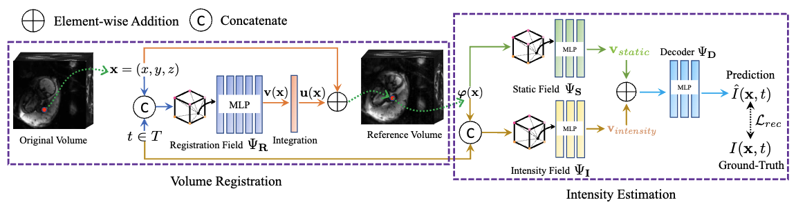

# Dynamic Neural Fields for Learning Atlases of 4D Fetal MRI Time-series

This repository contains the PyTorch implementation of the paper **Dynamic Neural Fields for Learning Atlases of 4D Fetal MRI Time-series**, which was accepted by [Medical Imaging Meets NeurIPS 2023](https://sites.google.com/view/med-neurips2023). Only **3D** MRI data can be processed, and MRIs within the same subject must be identical in image sizes.



## Citation

If you find anything in the paper or repository useful, please consider citing:

```plaintext
@misc{chi2023dynamic,
      title={Dynamic Neural Fields for Learning Atlases of 4D Fetal MRI Time-series}, 
      author={Zeen Chi and Zhongxiao Cong and Clinton Wang and Yingcheng Liu and Esra Abaci Turk and P. Ellen Grant and S. Mazdak Abulnaga and Polina Golland and Neel Dey},
      year={2023},
      eprint={https://arxiv.org/abs/2311.02874},
      archivePrefix={arXiv},
      primaryClass={cs.CV}
}
```

## Environment Setup

Clone this repo:

```shell
git clone https://github.com/Kidrauh/neural-atlasing.git
```

### General Environment

If your Linux system is Ubuntu 22.04 with gcc 11.3, please execute the following command:

```shell
conda env create -f environment.yml
```

The environment we provide uses CUDA 11.7, which is compatible with gcc 11.3. If you're using lower versions of gcc, please use CUDA 11.3 or any compatible version of CUDA, but the runtime may be stretched.

Some key packages:

- Python 3.8
- PyTorch 1.13
- [Tinycudann](https://github.com/NVlabs/tiny-cuda-nn)
- [pytorch3d](https://github.com/facebookresearch/pytorch3d/blob/main/INSTALL.md)
- OpenCV
- scikit-learn
- nibabel
- scipy
- wandb

### WanDB Setup

We use [WanDB](https://wandb.ai/) for runtime status inspection. You should register for an account if you don't have one, and save your own WanDB API key locally in `.wandb` file. Please explicitly set the environment variable `$NFS` in your own computer and organize your directory structure like this:

```
|-- $NFS
   |-- .wandb
   |-- code
      |-- sinf
         |-- ...
```

### Final Setup

To finally setup the code, please execute:

```shell
cd $NFS/code/sinf
pip install -e .
```

## Dataset Structure

Our fetal BOLD MRI dataset is private, but we offer the structure of the dataset below, so that as long as you organize your own fetal MRI dataset following our instruction, the code can run normally.

Suppose we have several fetal MRI subjects, named after subject1, subject2, etc., and each subject contains a sequence of fetal MRI nifti files and their corresponding segmentation files (either placental or multi-label segmentation). For atlas-as-brigde evaluation, the indices of images or segmentations of each pair are stored in `pairs.txt`, and you should format it as below, with two index numbers at each row, separated by a single space:

```
id1 id2
id1 id2
id1 id2
.......
```

And the whole dataset, including MRI images, segmentations, and pairs, shoudl be organized as below (please explicitly set the environment variable `$DS_DIR` in your own computer):

```
|-- $DS_DIR
   |-- subject1
   |  |-- images
   |  |  |-- img1.nii.gz
   |  |  |-- img2.nii.gz
   |  |  |-- ...
   |  |-- segs
   |  |  |-- seg1.nii.gz
   |  |  |-- seg2.nii.gz
   |  |  |-- ...
   |  |-- pairs.txt
   |-- subject2
   |  |-- images
   |  |  |-- ...
   |  |-- segs
   |  |  |-- ...
   |  |-- pairs.txt
   |-- ...
```

## Training & Atlas Construction

To train the dynamic neural fields for atlas learning, run `scripts/fit_inr.sh JobName fet_base SubjectName`, where `JobName` and `SubjectName` are specified by yourself.

After the training process is done, you can find the constructed atlas in `$NFS/code/sinf/results/{JobName}/atlas-{JobName}.nii.gz`.

## Registration

To register all MRIs of a certain subject to the constructed atlas, run `scripts/warp.sh JobName`, and the registered MRI time series are stored as `$NFS/code/sinf/results/{JobName}/{JobName}_WarpedToAtlas.mp4`.

## Evaluation

To conduct the atlas-as-bridge evaluation of segmentation DICE scores and Local Normalized Cross-Correlation (LNCC), run `scripts/eval.sh JobName NumLabels`, where `NumLabels` refers to the number of regions in your segmentations. For example, in our experiment we segmented the uterine to `NumLabels=5` parts, namely placenta, amniotic fluid, fetal body, fetal brain, and fetal eyes. The evaluation results are stored in `$NFS/code/sinf/results/{JobName}/stats.txt`.
